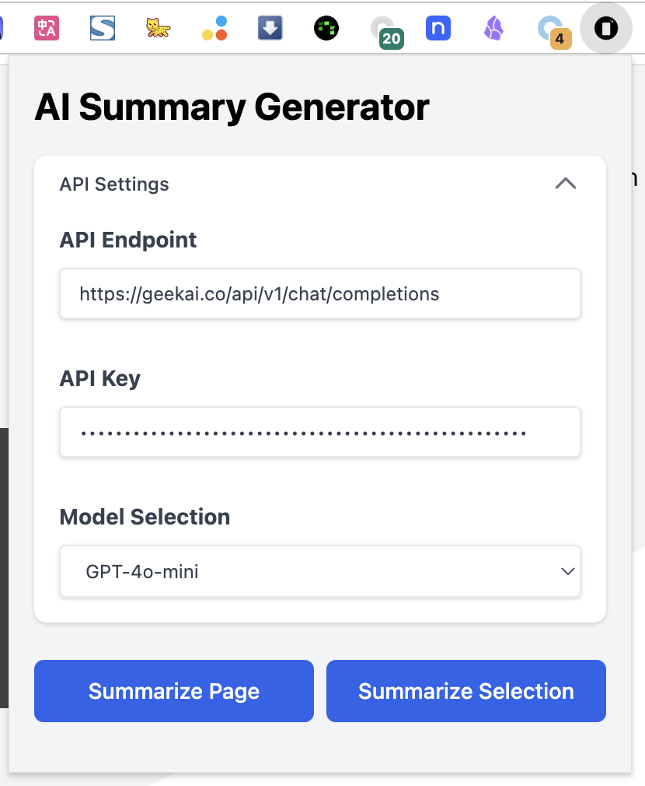
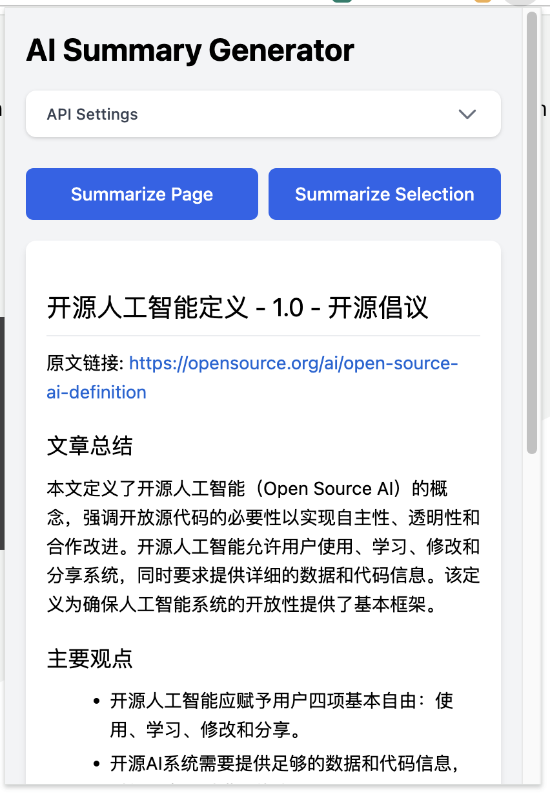
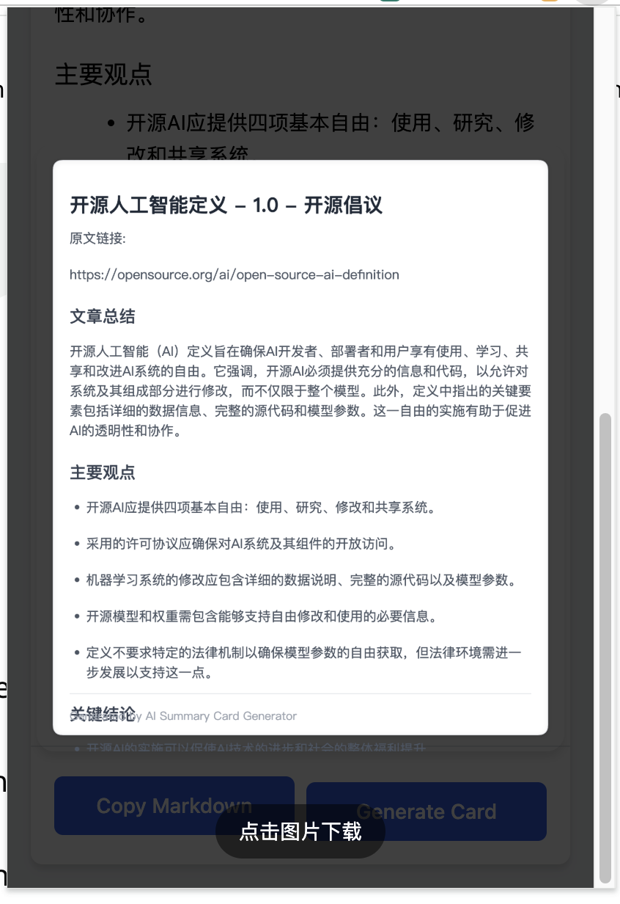

# Page Summarizer

Chrome 插件，一个简单高效的网页内容摘要工具。可以快速提取和总结网页的主要内容,生成简洁的摘要文本。一键拷贝摘要，一键生成可分享的知识卡片。

## 功能特点

- 🚀 快速提取网页主要内容
- 📝 智能生成内容摘要
- 🎯 支持自定义摘要长度
- 💻 一键快速拷贝摘要
- 🔌 一键生成可分享的知识卡片

## 截屏演示

配置界面

摘要

卡片

